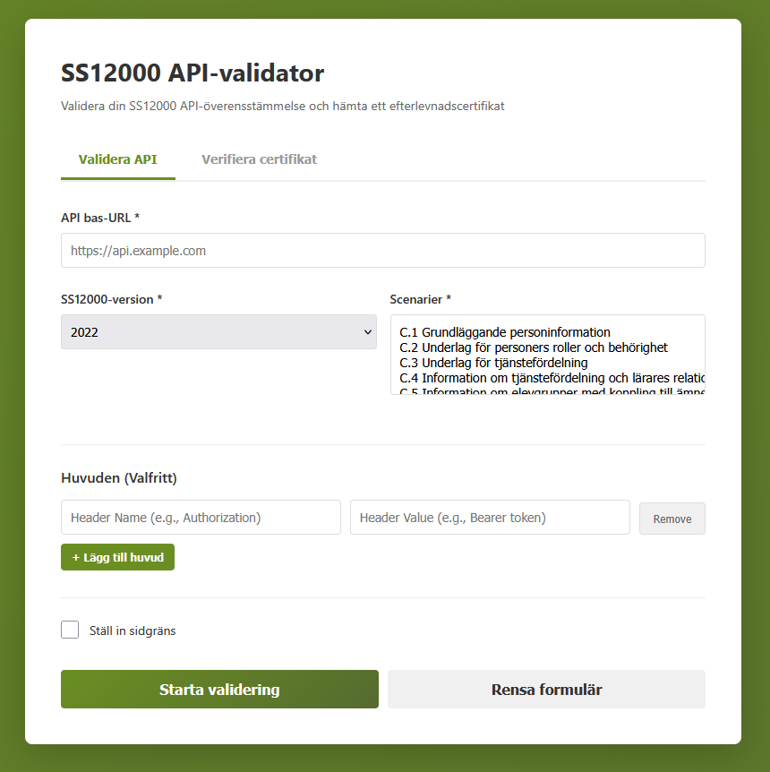

# SS12000 API-validator

En webbaserad validatorapplikation för testning och validering av SS12000 API-slutpunkter mot OpenAPI-specifikationen. Systemet kan generera och verifiera efterlevnadscertifikat för godkända API-implementationer.

## Om SS12000

SS12000 är en svensk standard från SIS (Svenska Institutet för Standardisering) för datautbyte inom skolans styrning och administration. Standarden definierar ett RESTful API för hantering av skolorganisationer, elever, personal, betyg och övrig skolrelaterad data.

## Funktionalitet

### Validering av API

Applikationen tillåter användare att:

- Testa en SS12000 API-slutpunkt mot valda valideringsscenarier
- Validera API-svar mot OpenAPI-schemat (version 2020 eller 2022)
- Definiera anpassade HTTP-huvuden (t.ex. autentiseringstoken)
- Ställa in sidgränser för pagineringstest (1-50)
- Se detaljerade felmeddelanden som pekar på exakta valideringsproblem

### Flerstegstestning

Varje testscenarion kan bestå av flera steg som körs i följd:

1. Första steget gör ett API-anrop
2. Resultatet valideras mot det förväntade schemat
3. Data extraheras från resultatet (t.ex. ID-värden)
4. Nästa steg använder denna data i sin endpoint-URL
5. Processen fortsätter tills alla steg är avslutade

### Efterlevnadscertifikat

När alla valideringsscenarier passerar genereras ett självskrivningsigned efterlevnadscertifikat som innehåller:

- Tidsstämpel för testexekveringen
- API-URL som testades
- SS12000-version som användes
- Lista över testade scenarier
- Detaljerade testresultat
- HMAC-SHA256-signatur för autenticitetsverifiering

Med certifikatverifieringsfunktionen kan externa parter bekräfta:

- Att certifikatet inte har manipulerats
- När det utfärdades och när det upphör att gälla
- Vilka scenarier som testades
- Det övergripande resultatstatus

## Installation

### Förutsättningar

- Python 3.8 eller senare
- pip (Python-pakethanterare)

### Steg 1: Klona repositoriet

```bash
git clone https://github.com/Delph1/ss12k_validator.git
cd ss12k_validator
```

### Steg 2: Installera Python-beroenden

```bash
pip install -r requirements.txt
```

### Steg 3: Konfigurera scenarier

Redigera filen `scenarios.yaml` och definiera dina testscenarier. Se avsnittet "Scenariostruktur" nedan.

### Steg 4: Starta applikationen

```bash
python app.py
```

Applikationen kommer att vara tillgänglig på `http://localhost:8000`

## Installation med Docker

### Förutsättningar

- Docker
- Docker Compose (rekommenderat)

### Med Docker Compose (rekommenderat)

```bash
git clone https://github.com/Delph1/ss12k_validator.git
cd ss12k_validator
docker-compose up
```

Applikationen är sedan tillgänglig på `http://localhost:8000`

För att stoppa applikationen:
```bash
docker-compose down
```

### Med Docker direkt

Bygga Docker-image:
```bash
docker build -t ss12k-validator .
```

Köra containern:
```bash
docker run -p 8000:8000 -v $(pwd)/scenarios.yaml:/app/scenarios.yaml ss12k-validator
```

På Windows (PowerShell):
```powershell
docker run -p 8000:8000 -v ${PWD}/scenarios.yaml:/app/scenarios.yaml ss12k-validator
```

## Användning

### Via webbgränssnittet



1. Öppna `http://localhost:8000` i din webbläsare
2. Välj fliken "Validera API"
3. Ange API:s bas-URL (t.ex. `https://api.example.com`)
4. Välj SS12000-version (2020 eller 2022)
5. Välj vilka valideringsscenarier som ska köras
6. (Valfritt) Lägg till HTTP-huvuden för autentisering eller annat
7. (Valfritt) Ställ in en sidgräns mellan 1-50
8. Klicka "Starta validering"

Om alla tester passerar:
- Klicka "Ladda ned efterlevnadscertifikat" för att spara certifikatet
- Gå till fliken "Verifiera certifikat" för att senare verifiera certifikat

### Verifiera certifikat

1. Gå till fliken "Verifiera certifikat"
2. Ladda upp en certifikatfil (dra och släpp eller klicka för att välja)
3. Klicka "Verifiera certifikat"
4. Se verifieringsresultatet och certifikatets detaljer

## Scenariostruktur

Scenarier definieras i filen `scenarios.yaml`. Varje scenario innehåller en serie steg som körs sekventiellt.

### Exempel på scenariostruktur

```yaml
scenarios:
  organisationer_och_elever:
    name: "Organisationer och elever"
    description: "Hämta organisationer och elever relaterade till en organisation"
    steps:
      - name: "Hämta organisationer"
        method: GET
        endpoint: /organisations
        expectedSchema: Organisations
        extractData:
          org_id: "data[0].id"
      
      - name: "Hämta elever för organisation"
        method: GET
        endpoint: "/persons?relationship.organisation={org_id}"
        expectedSchema: Persons
        extractData:
          elev_id: "data[0].id"
```

### Scenariokomponenter

- `name`: Scenariots namn (visas i gränssnittet)
- `description`: Kort beskrivning av vad scenariot testar
- `steps`: Lista med teststeg som körs i ordning

### Stegkomponenter

- `name`: Stegnamn (visas i resultat)
- `method`: HTTP-metod (GET, POST, PUT, DELETE, etc.)
- `endpoint`: API-slutpunkt (relativ till bas-URL)
- `expectedSchema`: (Valfritt) OpenAPI-schemakomponent att validera mot
- `extractData`: (Valfritt) JSONPath-uttryck för extrahering av data

### JSONPath-syntax för datextrahering

Använd JSONPath för att extrahera värden från API-svar:

- `data[0].id` - Hämta ID från första objektet i data-array
- `organisations[0].schoolTypes` - Hämta schoolTypes-array från första organisation
- `$.meta.pageToken` - Använd jQuery-syntax för att navigera strukturen

Extraherad data kan användas i senare steg genom `{variable_name}`-platshållare.

## Projektstruktur

```
ss12k_validator/
├── app.py                      # FastAPI-applikationen
├── config.py                   # Konfigurationsinställningar
├── requirements.txt            # Python-beroenden
├── scenarios.yaml              # Scenariodefinitioner
├── validators/
│   ├── schema_loader.py       # OpenAPI-schemahantering
│   ├── data_extractor.py      # JSONPath-datextrahering
│   ├── scenario_executor.py   # Testkörning
│   ├── cert_manager.py        # Certifikathantering
│   └── __init__.py
├── templates/
│   └── index.html             # Webbgränssnittet
├── static/
│   └── js/
│       └── app.js             # Frontend-logik
└── versions/
    ├── 2020/
    │   └── ss12000v2.yaml     # OpenAPI 2020-specifikation
    └── 2022/
        └── openapi_ss12000_version2_1_0.yaml  # OpenAPI 2022-specifikation
```

## API-dokumentation

Applikationen exponerar följande slutpunkter:

### `GET /`

Serverar webbgränssnittet.

### `GET /api/scenarios`

Returnerar lista över tillgängliga testscenarier.

Svar:
```json
{
  "scenarios": [
    {
      "id": "scenario_id",
      "name": "Scenario Name",
      "description": "Scenario Description"
    }
  ]
}
```

### `GET /api/versions`

Returnerar lista över stödda SS12000-versioner.

Svar:
```json
{
  "versions": ["2020", "2022"]
}
```

### `POST /api/validate`

Kör valideringsscenarier mot en API-slutpunkt.

Begäran:
```json
{
  "api_url": "https://api.example.com",
  "version": "2022",
  "scenarios": ["scenario_id_1", "scenario_id_2"],
  "headers": [
    {"key": "Authorization", "value": "Bearer token..."}
  ],
  "limit": 10
}
```

Svar (vid framgång):
```json
{
  "status": "pass",
  "test_results": {...},
  "certificate": {...}
}
```

### `POST /api/verify-certificate`

Verifierar autenticiteten på ett certifikat.

Begäran: multipart/form-data med certifikatfilen

Svar:
```json
{
  "valid": true,
  "api_url": "https://api.example.com",
  "ss12000_version": "2022",
  "overall_status": "pass",
  "issued_at": "2026-03-04T10:30:00Z",
  "expires_at": "2027-03-04T10:30:00Z",
  "scenarios_tested": ["scenario_id_1"]
}
```

## Konfiguration

Huvudkonfigurationen finns i `config.py`:

- `API_TIMEOUT_SECONDS`: Timeout för API-anrop (standard: 30 sekunder)
- `MIN_LIMIT` / `MAX_LIMIT`: Gränsintervall för sidgränser (1-50)
- `CERT_EXPIRY_DAYS`: Giltighet för certifikat (standard: 365 dagar)
- `SUPPORTED_VERSIONS`: Stödda SS12000-versioner

Miljövariabler:
- `DEBUG`: Sätt till "true" för debug-läge
- `CERT_SECRET_KEY`: Hemlig nyckel för certifikatsignering

## Säkerhet

- Alla API-anrop görs från servern, inte från klientens webbläsare
- Certifikatverifiering använder HMAC-SHA256-signering
- Användarindata valideras strikt på både klient- och serversidan
- Ingen känslig data lagras mellan sessioner

## Licensiering

Projektet är licensierat under MIT-licensen. Se LICENSE-filen för detaljer.

## Bidrag

Bidrag är välkomna. Vänligen skapa en fork, gör dina ändringar och skicka en pull request.

## Felsökning

### "Inga scenarier tillgängliga"

Kontrollera att `scenarios.yaml` existerar och innehåller giltiga scenariodefinitioner.

### API-anrop timeout

Öka `API_TIMEOUT_SECONDS` i `config.py` för långsammare API:er.

### Certifikatverifiering misslyckades

Se till att du verifierar det certifikat som generades av denna applikation. Certifikat från andra källor kan inte verifieras.

## Kontakt

För frågor eller problem, vänligen öppna ett issue i repositoriet.
